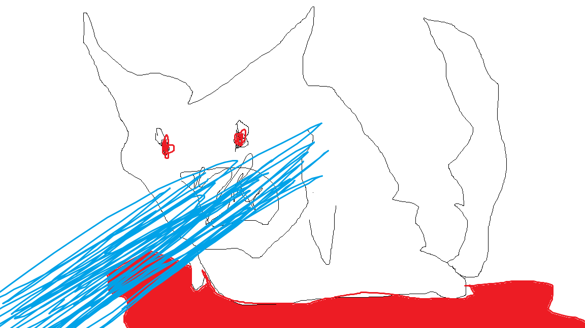
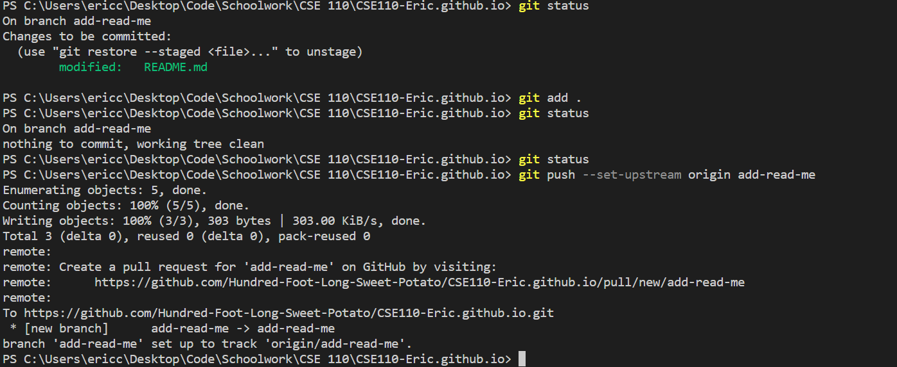

## Eric Chen's User Page!

### Table of contents!
[Go to Tasks!](#tasks)

[Go to Who I Am!](#who-am-i)

[languages](#some-languages-i-know)

[tech](#tech-i-have-experience-in) 

### Tasks!
- [ ] See who I am!
- [ ] See some languages I know!
- [ ] See the tech I have experience with! 

### Who Am I? 👺🍆
~~I am a nugget who likes eating eggpl 🍆💦 ~~

> I am a third year computer science student who is passionate about

> the software side of things!

` git add 🍆💦🍆💦🍆💦`

` git commit -m egggs`

` git push `

A Button Appears! Press? [Button!](https://www.youtube.com/watch?v=dQw4w9WgXcQ)

[A button that goes to Itself!?](root/index.md)

### Some languages I know
- C#
- C++
- Java
- Python

### Tech I have experience in

1. Html, CSS and Javascript
2. React native
3. Git and Agile
4. Unity and Unreal

### In case you guys wanna see the pictures here for some reason!

